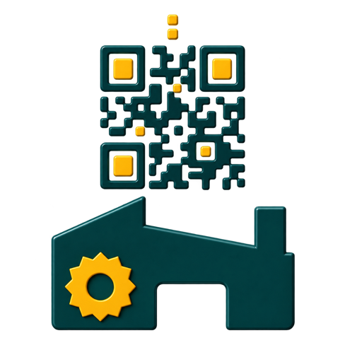

# QR Werk

[English](README.md) | [Deutsch](README.de.md)

[](LICENSE)
[](https://github.com/Globi-vs-Globine/qr-werk/tree/dev/ios-history-export)

<p align="center">
  
</p>

QR Werk ist eine datenschutzfreundliche App zum Scannen, Erstellen und Organisieren von QR-Codes und Barcodes. Sie ist ein auf iOS ausgerichteter Fork von [Simple QR von Tom Fong](https://github.com/tomfong/simple-qr) und wird unabhängig unter der GNU General Public License v3.0 weiterentwickelt.

> **Entwicklungsstand**
>
> QR Werk wird derzeit für iPhone und iPad entwickelt und getestet. Die App wurde noch nicht im Apple App Store veröffentlicht. Daher gibt es momentan keinen Download- oder Bewertungslink.

Die ausführliche [Dokumentation zu QR Werk](docs/README.md) ist auf Deutsch verfügbar und zusätzlich in der App unter **Einstellungen → Anleitung** offline enthalten.

Die Verarbeitung und das Protokoll bleiben standardmässig lokal auf dem Gerät. Eine Internetverbindung wird nur für Aktionen verwendet, die der Benutzer ausdrücklich auslöst, beispielsweise das Öffnen einer Internetadresse.

## Funktionen

### Scannen

- QR-Codes und verbreitete Barcode-Formate mit dem nativen iOS-Kamerascanner erfassen.
- Unterstützte Formate: QR Code, EAN-8, EAN-13, UPC-A, UPC-E, Code 39, Code 93, Code 128, Codabar, ITF, Aztec, Data Matrix und PDF417.
- Mehrere Codes mit Batch-Scannen nacheinander erfassen und direkt einer Gruppe zuweisen.
- Verhalten bei doppelten Codes, Scanpause und Autofokus einstellen.
- Scans nach Präfix, Suffix und genauer Zeichenanzahl filtern und Bedingungen mit einem Testfeld prüfen.
- Codes manuell eingeben, wenn ein beschädigtes Etikett nicht zuverlässig gelesen werden kann.
- Im nativen iOS-Scanner zwischen 1×- und 2×-Zoom wechseln.
- Ein oder mehrere Bilder aus der Fotomediathek importieren.
- Mehrere Codes in einem einzigen Bild erkennen.
- Erkannte Codes prüfen und alle oder nur eine Auswahl speichern.

### Protokoll und Gruppen

- Gescannte, importierte und erstellte Codes lokal protokollieren.
- Wichtige Einträge mit einem Lesezeichen versehen.
- Gruppen unabhängig von vorhandenen Einträgen erstellen, umbenennen und löschen.
- Einzelne Einträge in Gruppen verschieben.
- Gruppen für eine bessere Übersicht ein- und ausklappen.
- Einzelne Einträge oder vollständige Gruppen für den Export auswählen.
- Als CSV oder TXT exportieren – wahlweise mit vollständigen Angaben oder nur mit den Code-Inhalten.
- Ausgewählte Code-Inhalte direkt in die Zwischenablage kopieren.
- Datensätze sichern und wiederherstellen.

### Codes erstellen und Aktionen

- QR-Codes aus Text, Internetadressen, Kontakten, Telefonnummern, Nachrichten, E-Mail-Adressen, WLAN-Zugangsdaten und Standorten erstellen.
- Inhaltsabhängige Aktionen verwenden, beispielsweise Links öffnen, Inhalte kopieren oder eine Websuche starten.
- Erstellte QR-Codes und die Darstellung der App anpassen.
- Zwischen heller, dunkler und schwarzer Darstellung sowie sechs Akzentfarben wählen.

## Sprachen

QR Werk ist auf Deutsch, Englisch, Französisch und Italienisch verfügbar. Verwendet das iPhone oder iPad eine andere Systemsprache, wird Englisch als Ersatzsprache verwendet.

## Datenschutz

Die App besitzt kein Werbe-Backend und benötigt kein Benutzerkonto. Scan-Protokoll und Gruppen werden lokal gespeichert. Auf Kamera und Fotomediathek wird nur zugegriffen, wenn der Benutzer einen Scan oder Bildimport auslöst.

Weitere Informationen enthält [PRIVACY.md](PRIVACY.md). Die optionale iCloud-Synchronisierung ist standardmässig ausgeschaltet und speichert ausgewählte App-Daten ausschliesslich in der privaten CloudKit-Datenbank des Benutzers.

## iOS-Entwicklung

Ausführliche Voraussetzungen, Build-Anweisungen, bekannte iOS-Hürden und GPL-Hinweise stehen in [docs/ios-development.md](docs/ios-development.md).

Grundlegender Entwicklungsablauf:

```sh
npm install
npm run build
npx cap sync ios
```

Anschließend `ios/App/QRWerk.xcworkspace` in Xcode öffnen. Für die Installation auf einem physischen iPhone oder iPad werden eine eindeutige Bundle-ID und ein gültiges Apple-Entwicklungsteam benötigt.

## Projektstatus und Versionen

- Die aktive Entwicklung findet auf [`dev/ios-history-export`](https://github.com/Globi-vs-Globine/qr-werk/tree/dev/ios-history-export) statt.
- Änderungen werden über Pull Requests geprüft, bevor sie in `main` übernommen werden.
- Für QR Werk gibt es momentan weder eine offizielle App-Store-Veröffentlichung noch eine verpackte GitHub-Version.
- Fehler und Funktionswünsche für diesen Fork gehören in die [GitHub Issues](https://github.com/Globi-vs-Globine/qr-werk/issues).

## Herkunft und Namensnennung

Das ursprüngliche Projekt Simple QR wurde von **Tom Fong** erstellt und ist unter [tomfong/simple-qr](https://github.com/tomfong/simple-qr) verfügbar. Die ursprünglichen Mitwirkenden und ihre Arbeit bleiben über den Git-Verlauf und das Upstream-Repository dokumentiert.

Dieser Fork wird unabhängig unter [Globi-vs-Globine/qr-werk](https://github.com/Globi-vs-Globine/qr-werk) gepflegt. Veröffentlichungen, persönliche Profile, Sponsorenseiten und Demonstrationen des ursprünglichen Projekts werden nicht als Veröffentlichungen oder Empfehlungen dieses Forks dargestellt.

## Technik

- Ionic und Angular
- Capacitor 7
- Capacitor ML Kit Barcode Scanning
- Natives iOS-Projekt mit CocoaPods

## Lizenz

QR Werk und dieser Fork stehen unter der [GNU General Public License v3.0](LICENSE). Copyright-Hinweise, Git-Verlauf, Namensnennung und der zugehörige Quellcode müssen bei einer Weitergabe der Software verfügbar bleiben.

Der kompakte Herkunfts- und Änderungshinweis befindet sich in [NOTICE](NOTICE).
